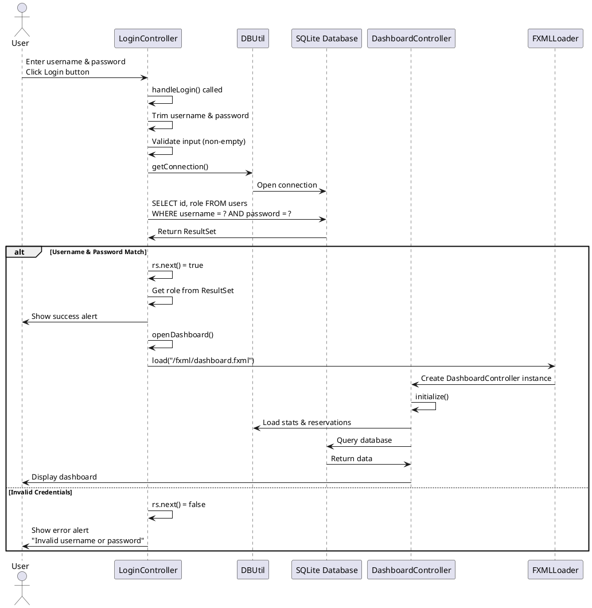
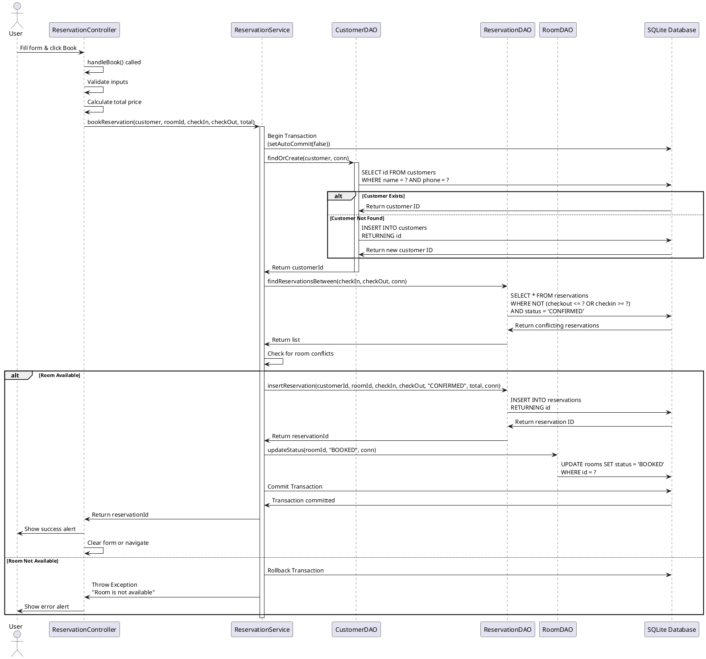
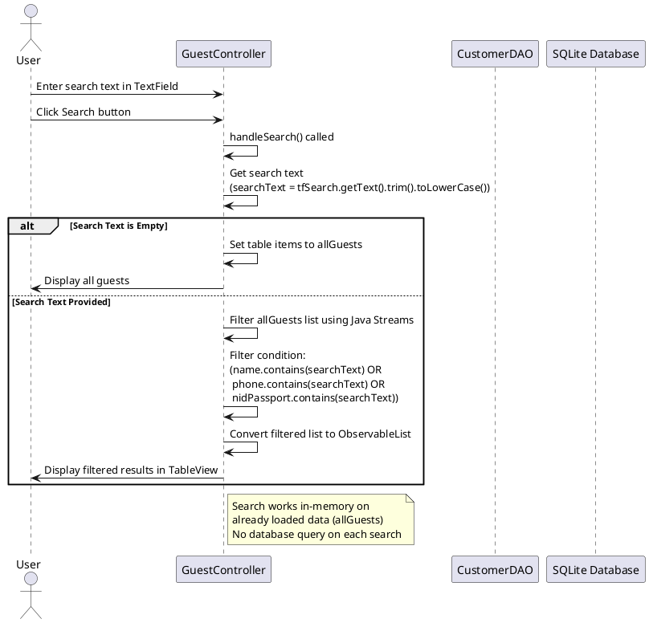

# Hotel Reservation System - Complete Project Overview

## Table of Contents
1. [Project Introduction](#project-introduction)
2. [System Architecture](#system-architecture)
3. [OOP Concepts Used](#oop-concepts-used)
4. [UML Diagrams](#uml-diagrams)
5. [Database Design](#database-design)
6. [Component Details](#component-details)
7. [Feature Explanations](#feature-explanations)
8. [Workflow Diagrams](#workflow-diagrams)

---

## Project Introduction

The **Hotel Reservation System** is a desktop application built using **JavaFX** for the user interface and **SQLite** for data persistence. It provides comprehensive functionality for managing hotel reservations, customers, rooms, and check-in/check-out operations.

### Technology Stack
- **Frontend**: JavaFX (FXML, Controllers)
- **Backend**: Java (JDK 25)
- **Database**: SQLite (JDBC)
- **Build Tool**: Maven
- **Architecture Pattern**: MVC (Model-View-Controller) + DAO (Data Access Object) + Service Layer

---

## System Architecture

### Architecture Layers

```
┌─────────────────────────────────────────────────────────┐
│                    PRESENTATION LAYER                   │
│  (JavaFX Views - FXML Files + Controllers)              │
│  • LoginController                                      │
│  • DashboardController                                  │
│  • ReservationController                                │
│  • GuestController                                      │
│  • RoomController                                       │
│  • CheckInOutController                                 │
│  • ReservationDetailController                          │
└─────────────────────────────────────────────────────────┘
                          ↓
┌─────────────────────────────────────────────────────────┐
│                      SERVICE LAYER                       │
│  (Business Logic)                                        │
│  • ReservationService                                    │
└─────────────────────────────────────────────────────────┘
                          ↓
┌─────────────────────────────────────────────────────────┐
│                    DATA ACCESS LAYER                     │
│  (DAO Pattern)                                           │
│  • CustomerDAO                                           │
│  • ReservationDAO                                        │
│  • RoomDAO                                               │
└─────────────────────────────────────────────────────────┘
                          ↓
┌─────────────────────────────────────────────────────────┐
│                      MODEL LAYER                         │
│  (Domain Objects)                                        │
│  • Customer                                              │
│  • Reservation                                           │
│  • Room                                                  │
└─────────────────────────────────────────────────────────┘
                          ↓
┌─────────────────────────────────────────────────────────┐
│                   DATABASE LAYER                         │
│  (SQLite via JDBC)                                       │
│  • hotel.db                                              │
│  • Tables: users, customers, rooms, reservations        │
└─────────────────────────────────────────────────────────┘
```

---

## OOP Concepts Used

### 1. **Encapsulation**
- All model classes (`Customer`, `Room`, `Reservation`) use private fields with public getters and setters
- Internal implementation details are hidden from outside access
- Example: `Customer.name` is private, accessed via `getName()` and `setName()`

### 2. **Abstraction**
- DAO classes abstract database operations (e.g., `CustomerDAO.createCustomer()` hides SQL complexity)
- Service layer abstracts business logic (e.g., `ReservationService.bookReservation()` orchestrates multiple operations)
- Controllers abstract UI interactions from business logic

### 3. **Inheritance**
- All controllers implicitly inherit from JavaFX `Controller` pattern via `@FXML` annotations
- `MainApp` extends `Application` (JavaFX base class)

### 4. **Polymorphism**
- **Method Overloading**: Multiple constructors in `Customer` and `Room` classes
- **Runtime Polymorphism**: Interface-based programming with DAO pattern (could be extended with interfaces)
- Example: `RoomDAO.updateStatus()` has overloaded methods with different signatures

### 5. **Composition**
- `Reservation` contains references to `Customer` and `Room` (composition relationship)
- Controllers compose DAO objects (e.g., `ReservationController` contains `RoomDAO` and `ReservationService`)
- Controllers compose JavaFX UI components

### 6. **Association**
- One-to-Many: One `Customer` can have many `Reservations`
- One-to-Many: One `Room` can have many `Reservations`
- Many-to-One: Many `Reservations` belong to one `Customer` and one `Room`

### 7. **Single Responsibility Principle (SRP)**
- Each class has one reason to change
- Models: Data representation only
- DAOs: Database operations only
- Services: Business logic only
- Controllers: UI handling only

### 8. **Dependency Injection (Manual)**
- Controllers manually create DAO and Service instances
- Could be improved with a DI framework, but current approach is clear

---

## UML Diagrams

### Class Diagram

```plantuml
@startuml
!theme plain
skinparam classAttributeIconSize 0

package "Models" {
    class Customer {
        -int id
        -String name
        -String phone
        -String email
        -String address
        -String nidPassport
        +Customer()
        +Customer(name, phone, email, address, nidPassport)
        +getId(): int
        +getName(): String
        +getPhone(): String
        +getEmail(): String
        +getAddress(): String
        +getNidPassport(): String
        +setId(id: int): void
        +setName(name: String): void
        +setPhone(phone: String): void
        +setEmail(email: String): void
        +setAddress(address: String): void
        +setNidPassport(nid: String): void
    }

    class Room {
        -int id
        -String roomNumber
        -String type
        -double price
        -String status
        +Room()
        +Room(id, roomNumber, type, price, status)
        +getId(): int
        +getRoomNumber(): String
        +getType(): String
        +getPrice(): double
        +getStatus(): String
        +setId(id: int): void
        +setRoomNumber(roomNumber: String): void
        +setType(type: String): void
        +setPrice(price: double): void
        +setStatus(status: String): void
        +toString(): String
    }

    class Reservation {
        -int id
        -int customerId
        -int roomId
        -LocalDate checkin
        -LocalDate checkout
        -String status
        -double total
        -String customerName
        -String customerPhone
        -String roomNumber
        +Reservation()
        +Reservation(customerId, roomId, checkin, checkout, status, total)
        +getId(): int
        +getCustomerId(): int
        +getRoomId(): int
        +getCheckin(): LocalDate
        +getCheckout(): LocalDate
        +getStatus(): String
        +getTotal(): double
        +getCustomerName(): String
        +getCustomerPhone(): String
        +getRoomNumber(): String
        +setId(id: int): void
        +setCustomerId(customerId: int): void
        +setRoomId(roomId: int): void
        +setCheckin(checkin: LocalDate): void
        +setCheckout(checkout: LocalDate): void
        +setStatus(status: String): void
        +setTotal(total: double): void
        +setCustomerName(name: String): void
        +setCustomerPhone(phone: String): void
        +setRoomNumber(roomNumber: String): void
    }
}

package "DAO Layer" {
    class CustomerDAO {
        +createCustomer(customer: Customer): int
        +findById(id: int): Customer
        +getAllCustomers(): List<Customer>
        +updateCustomer(customer: Customer): void
        +deleteCustomer(id: int): void
        +findOrCreate(customer: Customer, conn: Connection): int
    }

    class RoomDAO {
        +addRoom(room: Room): void
        +getAllRooms(): List<Room>
        +findById(id: int): Room
        +updateRoom(room: Room): void
        +updateStatus(roomId: int, status: String): void
        +updateStatus(roomId: int, status: String, conn: Connection): void
        +deleteRoom(id: int): void
        +getFreeRooms(): List<Room>
    }

    class ReservationDAO {
        +insertReservation(customerId, roomId, checkin, checkout, status, total): int
        +insertReservation(customerId, roomId, checkin, checkout, status, total, conn: Connection): int
        +findById(id: int): Reservation
        +findReservationsBetween(from: LocalDate, to: LocalDate): List<Reservation>
        +findReservationsBetween(from: LocalDate, to: LocalDate, conn: Connection): List<Reservation>
        +getAllReservations(): List<Reservation>
        +updateReservationDates(id, checkin, checkout, total): void
        +updateReservationDates(id, checkin, checkout, total, conn: Connection): void
        +updateStatus(id: int, status: String): void
        +updateStatus(id: int, status: String, conn: Connection): void
        +deleteReservation(id: int): void
        +getReservationsByCustomerId(customerId: int): List<Reservation>
        +getReservationsByCheckInDate(date: LocalDate): List<Reservation>
        +getReservationsByCheckOutDate(date: LocalDate): List<Reservation>
    }
}

package "Service Layer" {
    class ReservationService {
        -ReservationDAO reservationDAO
        -CustomerDAO customerDAO
        -RoomDAO roomDAO
        +bookReservation(customer: Customer, roomId: int, checkIn: LocalDate, checkOut: LocalDate, total: double): int
        +getReservationById(id: int): Reservation
        +cancelReservation(reservationId: int): void
        +updateReservationDates(reservationId: int, checkin: LocalDate, checkout: LocalDate, total: double): void
        +checkIn(reservationId: int): void
        +checkOut(reservationId: int): void
        +getTodayCheckIns(): List<Reservation>
        +getTodayCheckOuts(): List<Reservation>
    }
}

package "Controller Layer" {
    class LoginController {
        -TextField txtUser
        -PasswordField txtPass
        -Button btnDeveloperInfo
        +initialize(): void
        +handleLogin(): void
        +handleDeveloperInfo(): void
        -openDashboard(): void
    }

    class DashboardController {
        -Label lblTotalRooms
        -Label lblFreeRooms
        -Label lblOccupiedRooms
        -TableView<Reservation> tblReservations
        -RoomDAO roomDAO
        -ReservationDAO reservationDAO
        -CustomerDAO customerDAO
        -ReservationService reservationService
        +initialize(): void
        +loadStats(): void
        +loadRecentReservations(): void
        +openNewReservation(): void
        +openCheckInOut(): void
        +openGuests(): void
        +openRooms(): void
        +searchGuest(): void
        -openReservationDetail(reservationId: int): void
    }

    class ReservationController {
        -ComboBox<Room> cmbRoom
        -DatePicker dpCheckIn
        -DatePicker dpCheckOut
        -TextField tfName
        -TextField tfPhone
        -TextField tfAddress
        -TextField tfNidPassport
        -Label lblPrice
        -Label lblNights
        -Label lblTotal
        -RoomDAO roomDAO
        -ReservationService reservationService
        +initialize(): void
        +handleBook(): void
        +handleCalculate(): void
        -loadFreeRooms(): void
        -updatePrice(): void
    }

    class GuestController {
        -TableView<CustomerRow> tblGuests
        -TextField tfSearch
        -CustomerDAO customerDAO
        -ReservationDAO reservationDAO
        +initialize(): void
        +handleSearch(): void
        +handleClear(): void
        +viewGuestDetails(customer: Customer): void
        +handleSaveGuestDetails(customer: Customer, name, phone, address, nid: String): void
        -loadGuests(): void
        +goBack(): void
    }

    class CheckInOutController {
        -DatePicker dpDate
        -TableView<Reservation> tblCheckIns
        -TableView<Reservation> tblCheckOuts
        -ReservationService reservationService
        +initialize(): void
        +handleDateChange(): void
        +handleCheckIn(reservation: Reservation): void
        +handleCheckOut(reservation: Reservation): void
        +goBack(): void
    }

    class RoomController {
        -TableView<Room> tblRooms
        -RoomDAO roomDAO
        +initialize(): void
        +loadRooms(): void
        +goBack(): void
    }

    class ReservationDetailController {
        -Label lblReservationId
        -Label lblCustomerName
        -Label lblRoomNumber
        -Label lblCheckIn
        -Label lblCheckOut
        -Label lblStatus
        -Label lblTotal
        -Button btnCheckIn
        -Button btnCheckOut
        -ReservationService reservationService
        +setReservationId(id: int): void
        +loadReservation(): void
        +handleCheckIn(): void
        +handleCheckOut(): void
        +handleCancel(): void
        +goBack(): void
    }
}

package "Utilities" {
    class DBUtil {
        {static} +getConnection(): Connection
    }

    class DBInit {
        {static} -Path DB_FOLDER
        {static} -Path SCHEMA_FILE
        {static} -Path DB_FILE
        {static} -String JDBC_URL
        {static} +initDatabase(): void
        {static} +getJdbcUrl(): String
    }

    class DBManager {
        {static} +deleteAllData(): void
        {static} +changeAdminPassword(password: String): void
        {static} +ensureAdminUser(password: String): void
        {static} +ensureDefaultAdminUser(): void
    }
}

class MainApp {
    {static} +main(args: String[]): void
    +start(primaryStage: Stage): void
}

' Relationships
Reservation "1" *-- "1" Customer : references
Reservation "1" *-- "1" Room : references

CustomerDAO ..> Customer : uses
RoomDAO ..> Room : uses
ReservationDAO ..> Reservation : uses

ReservationService --> CustomerDAO : uses
ReservationService --> RoomDAO : uses
ReservationService --> ReservationDAO : uses

DashboardController --> ReservationService : uses
DashboardController --> CustomerDAO : uses
DashboardController --> RoomDAO : uses
DashboardController --> ReservationDAO : uses

ReservationController --> ReservationService : uses
ReservationController --> RoomDAO : uses

GuestController --> CustomerDAO : uses
GuestController --> ReservationDAO : uses

CheckInOutController --> ReservationService : uses

ReservationDetailController --> ReservationService : uses

RoomController --> RoomDAO : uses

All DAOs ..> DBUtil : uses
DBUtil ..> DBInit : uses
MainApp ..> DBInit : uses

@enduml
```

### Sequence Diagram: Login Process



### Sequence Diagram: Booking a Reservation



### Sequence Diagram: Search Functionality



---

## Database Design

### Entity Relationship Diagram

```
┌─────────────────┐         ┌──────────────────┐         ┌─────────────────┐
│    CUSTOMERS    │         │  RESERVATIONS    │         │      ROOMS      │
├─────────────────┤         ├──────────────────┤         ├─────────────────┤
│ PK id           │◄──┐     │ PK id            │     ┌──►│ PK id           │
│    name         │   │     │ FK customer_id   ├─────┘   │    room_number  │
│    phone        │   └─────┤ FK room_id       │         │    type         │
│    email        │         │    checkin       │         │    price        │
│    address      │         │    checkout      │         │    status       │
│    nid_passport │         │    status        │         │    created_at   │
│    created_at   │         │    total         │         └─────────────────┘
└─────────────────┘         │    created_at    │
                            └──────────────────┘
                                      ▲
                                      │
                            ┌─────────┴─────────┐
                            │                   │
                     ┌──────┴──────┐    ┌──────┴──────┐
                     │    USERS    │    │             │
                     ├─────────────┤    │  (Future    │
                     │ PK id       │    │   tables)   │
                     │    username │    │             │
                     │    password │    │             │
                     │    role     │    └─────────────┘
                     │    created_at│
                     └─────────────┘


                     
```

### Database Tables

#### 1. **users** Table
- **Purpose**: Store login credentials for system users
- **Fields**:
  - `id` (INTEGER PRIMARY KEY)
  - `username` (TEXT UNIQUE NOT NULL)
  - `password` (TEXT NOT NULL) - *Plain text for demo only*
  - `role` (TEXT DEFAULT 'STAFF') - Values: 'ADMIN', 'STAFF'
  - `created_at` (TEXT DEFAULT CURRENT_TIMESTAMP)

#### 2. **customers** Table
- **Purpose**: Store customer/guest information
- **Fields**:
  - `id` (INTEGER PRIMARY KEY AUTOINCREMENT)
  - `name` (TEXT NOT NULL)
  - `phone` (TEXT)
  - `email` (TEXT) - *Kept for backward compatibility, not used in UI*
  - `address` (TEXT) - Permanent address
  - `nid_passport` (TEXT) - National ID or Passport number
  - `created_at` (TEXT DEFAULT CURRENT_TIMESTAMP)

#### 3. **rooms** Table
- **Purpose**: Store room information
- **Fields**:
  - `id` (INTEGER PRIMARY KEY AUTOINCREMENT)
  - `room_number` (TEXT UNIQUE NOT NULL)
  - `type` (TEXT NOT NULL) - e.g., 'Single', 'Double', 'Deluxe', 'Suite'
  - `price` (REAL NOT NULL) - Price per night
  - `status` (TEXT NOT NULL DEFAULT 'FREE') - Values: 'FREE', 'BOOKED', 'OCCUPIED', 'MAINTENANCE'
  - `created_at` (TEXT DEFAULT CURRENT_TIMESTAMP)

#### 4. **reservations** Table
- **Purpose**: Store reservation records
- **Fields**:
  - `id` (INTEGER PRIMARY KEY AUTOINCREMENT)
  - `customer_id` (INTEGER NOT NULL) - FK to customers.id
  - `room_id` (INTEGER NOT NULL) - FK to rooms.id
  - `checkin` (TEXT NOT NULL) - ISO format: yyyy-MM-dd
  - `checkout` (TEXT NOT NULL) - ISO format: yyyy-MM-dd
  - `status` (TEXT NOT NULL) - Values: 'CONFIRMED', 'CHECKED_IN', 'COMPLETED', 'CANCELLED'
  - `total` (REAL NOT NULL) - Total price for the stay
  - `created_at` (TEXT DEFAULT CURRENT_TIMESTAMP)
- **Foreign Keys**:
  - `FOREIGN KEY(customer_id) REFERENCES customers(id) ON DELETE CASCADE`
  - `FOREIGN KEY(room_id) REFERENCES rooms(id) ON DELETE CASCADE`

### Database Indexes
- `idx_rooms_type` on `rooms.type` - For filtering rooms by type
- `idx_res_room` on `reservations.room_id` - For quick room reservation lookup
- `idx_res_checkin` on `reservations.checkin` - For date-based queries

### Database Relationships

1. **Customers → Reservations** (One-to-Many)
   - One customer can have many reservations
   - Foreign key: `reservations.customer_id`

2. **Rooms → Reservations** (One-to-Many)
   - One room can have many reservations (over time)
   - Foreign key: `reservations.room_id`

3. **Reservation Status Flow**:
   ```
   CONFIRMED → CHECKED_IN → COMPLETED
        ↓
    CANCELLED
   ```

4. **Room Status Flow**:
   ```
   FREE → BOOKED → OCCUPIED → FREE
        ↓
    MAINTENANCE → FREE
   ```

---

## Component Details

### 1. Models (Domain Objects)

#### Customer
- **Purpose**: Represents a hotel guest/customer
- **Key Features**:
  - Encapsulates customer information
  - Multiple constructors for different use cases
  - Standard getters/setters for all fields

#### Room
- **Purpose**: Represents a hotel room
- **Key Features**:
  - Status management (FREE, BOOKED, OCCUPIED, MAINTENANCE)
  - Custom `toString()` for display in ComboBoxes
  - Price stored as double for calculations

#### Reservation
- **Purpose**: Represents a booking/reservation
- **Key Features**:
  - Links customer and room via IDs
  - Includes convenience fields (`customerName`, `roomNumber`, `customerPhone`) for display
  - Status tracking through reservation lifecycle

### 2. DAO Layer (Data Access Objects)

#### Purpose
- Abstracts database operations
- Provides CRUD operations for each entity
- Handles SQL queries and ResultSet mapping

#### CustomerDAO
- `createCustomer()` - Insert new customer
- `findById()` - Get customer by ID
- `getAllCustomers()` - Get all customers
- `updateCustomer()` - Update customer information
- `deleteCustomer()` - Delete customer
- `findOrCreate()` - Find existing or create new (for transactions)

#### RoomDAO
- `addRoom()` - Add new room
- `getAllRooms()` - Get all rooms
- `findById()` - Get room by ID
- `updateRoom()` - Update room information
- `updateStatus()` - Update room status (supports transactions)
- `deleteRoom()` - Delete room
- `getFreeRooms()` - Get only available rooms

#### ReservationDAO
- `insertReservation()` - Create new reservation (supports transactions)
- `findById()` - Get reservation with joined customer/room data
- `findReservationsBetween()` - Find overlapping reservations (supports transactions)
- `getAllReservations()` - Get all with joined data
- `updateReservationDates()` - Update dates and total (supports transactions)
- `updateStatus()` - Update reservation status (supports transactions)
- `deleteReservation()` - Delete reservation
- `getReservationsByCustomerId()` - Get customer's history
- `getReservationsByCheckInDate()` - Get today's check-ins
- `getReservationsByCheckOutDate()` - Get today's check-outs

### 3. Service Layer

#### ReservationService
- **Purpose**: Orchestrates business logic for reservations
- **Key Methods**:
  - `bookReservation()` - Complete booking process with transaction
  - `cancelReservation()` - Cancel and free up room
  - `checkIn()` - Mark as checked in, room becomes OCCUPIED
  - `checkOut()` - Mark as completed, room becomes FREE
  - `updateReservationDates()` - Change dates (with recalculation)
  - `getTodayCheckIns()` - Get reservations checking in today
  - `getTodayCheckOuts()` - Get reservations checking out today

**Transaction Management**:
- Uses `Connection.setAutoCommit(false)` to start transactions
- Commits on success, rolls back on error
- Ensures data consistency (e.g., room status always matches reservation)

### 4. Controller Layer

#### LoginController
- **Responsibilities**:
  - Handle user authentication
  - Validate credentials against database
  - Navigate to dashboard on success
  - Show developer info popup

#### DashboardController
- **Responsibilities**:
  - Display statistics (total rooms, free rooms, booked rooms, reservations)
  - Show recent reservations in table
  - Search guest by phone/NID
  - Display guest information and purchase history
  - Navigate to other screens
  - Open reservation details on double-click

#### ReservationController
- **Responsibilities**:
  - Display available rooms in ComboBox
  - Handle date selection
  - Calculate total price automatically
  - Validate inputs
  - Submit booking request
  - Show success/error messages

#### GuestController
- **Responsibilities**:
  - Display all guests in table
  - Search/filter guests (name, phone, NID)
  - Show guest details dialog
  - Edit guest information
  - Display purchase history

#### CheckInOutController
- **Responsibilities**:
  - Show check-ins for selected date
  - Show check-outs for selected date
  - Perform check-in operation
  - Perform check-out operation

#### RoomController
- **Responsibilities**:
  - Display all rooms
  - Show room status
  - Navigate back to dashboard

#### ReservationDetailController
- **Responsibilities**:
  - Display full reservation details
  - Allow check-in/check-out actions
  - Allow cancellation
  - Navigate back

### 5. Utility Classes

#### DBUtil
- **Purpose**: Connection factory
- Provides single method: `getConnection()` - Returns SQLite connection

#### DBInit
- **Purpose**: Database initialization and migration
- **Responsibilities**:
  - Create database file if not exists
  - Execute schema.sql
  - Run migrations (add columns if missing)
  - Seed default admin user
  - Seed sample rooms if database is empty

#### DBManager
- **Purpose**: Database administration utilities
- **Methods**:
  - `deleteAllData()` - Clear all data (preserves users)
  - `changeAdminPassword()` - Update admin password
  - `ensureAdminUser()` - Create/update admin user
  - `ensureDefaultAdminUser()` - Ensure admin exists with default password

---

## Feature Explanations

### 1. Login System

#### How It Works

1. **User enters credentials**:
   - Username and password in TextFields
   - Login button triggers `handleLogin()` method

2. **Validation**:
   ```java
   String user = txtUser.getText().trim();
   String pass = txtPass.getText().trim();
   if (user.isEmpty()) { show error; return; }
   if (pass.isEmpty()) { show error; return; }
   ```

3. **Database Query**:
   ```java
   SELECT id, role FROM users 
   WHERE username = ? AND password = ?
   ```
   - Uses PreparedStatement to prevent SQL injection
   - Trims input to handle whitespace

4. **Result Processing**:
   - If `ResultSet.next()` returns true → Login successful
   - Extract role from ResultSet
   - Show success alert
   - Navigate to dashboard

5. **Navigation**:
   ```java
   FXMLLoader loader = new FXMLLoader(getClass().getResource("/fxml/dashboard.fxml"));
   Parent root = loader.load();
   Stage stage = (Stage) txtUser.getScene().getWindow();
   stage.setScene(new Scene(root));
   ```
   - Creates new Scene from FXML
   - Replaces current Scene in same Stage
   - DashboardController.initialize() is automatically called

### 2. Button Click and Page Navigation

#### JavaFX Event Handling

1. **FXML Declaration**:
   ```xml
   <Button text="New Reservation" onAction="#openNewReservation"/>
   ```
   - `onAction` attribute links to controller method
   - Method name must match exactly

2. **Controller Method**:
   ```java
   @FXML
   public void openNewReservation() {
       try {
           FXMLLoader loader = new FXMLLoader(getClass().getResource("/fxml/reserve.fxml"));
           Parent root = loader.load();
           Stage stage = (Stage) lblTotalRooms.getScene().getWindow();
           stage.setScene(new Scene(root));
           stage.setTitle("New Reservation");
       } catch (Exception e) { ... }
   }
   ```

3. **How FXML Loading Works**:
   - `FXMLLoader.load()` reads FXML file
   - Instantiates controller class (defined in `fx:controller`)
   - Injects `@FXML` annotated fields
   - Calls controller's `initialize()` method (if exists)
   - Returns `Parent` node (root of UI hierarchy)

4. **Scene Replacement**:
   - `Stage.setScene()` replaces entire UI
   - Previous controller is garbage collected
   - New controller's `initialize()` runs

### 3. Search Functionality

#### Two Types of Search

#### A. Guest Search (GuestController) - In-Memory Filtering

**How It Works**:
1. **Data Loading**:
   ```java
   private ObservableList<CustomerRow> allGuests = FXCollections.observableArrayList();
   
   private void loadGuests() {
       List<Customer> customers = customerDAO.getAllCustomers();
       // ... load all guests into allGuests
   }
   ```

2. **Search Handler**:
   ```java
   @FXML
   public void handleSearch() {
       String searchText = tfSearch.getText().trim().toLowerCase();
       if (searchText.isEmpty()) {
           tblGuests.setItems(allGuests); // Show all
           return;
       }
       
       List<CustomerRow> filtered = allGuests.stream()
           .filter(row -> {
               Customer c = row.getCustomer();
               return (c.getName() != null && c.getName().toLowerCase().contains(searchText)) ||
                      (c.getPhone() != null && c.getPhone().contains(searchText)) ||
                      (c.getNidPassport() != null && c.getNidPassport().toLowerCase().contains(searchText));
           })
           .collect(Collectors.toList());
       
       tblGuests.setItems(FXCollections.observableArrayList(filtered));
   }
   ```

3. **How It Works**:
   - Uses Java 8 Streams API for filtering
   - Filters on already-loaded data (no database query)
   - Case-insensitive search (converts to lowercase)
   - Searches across multiple fields (name, phone, NID)
   - Updates TableView with filtered list

**Advantages**:
- Fast (no database query)
- Works offline on loaded data
- Supports complex filtering logic

**Disadvantages**:
- Requires all data in memory
- Not suitable for very large datasets

#### B. Guest Search (DashboardController) - Database Query

**How It Works**:
1. **Database Query**:
   ```java
   String sql = "SELECT id, name, phone, " +
                "COALESCE(address, '') as address, " +
                "COALESCE(nid_passport, '') as nid_passport " +
                "FROM customers WHERE phone = ? OR nid_passport = ?";
   ```

2. **Exact Match Search**:
   - Searches by phone or NID/Passport (exact match)
   - Uses `COALESCE` to handle NULL values
   - Returns single customer or none

3. **Display Results**:
   - Shows customer information in GridPane
   - Loads purchase history from database

**Advantages**:
- Works with any dataset size
- Database indexing for fast lookup
- Exact match search

**Disadvantages**:
- Requires database connection
- Less flexible than in-memory filtering

### 4. Reservation Booking Process

#### Step-by-Step Flow

1. **User Fills Form**:
   - Selects room from ComboBox (only FREE rooms shown)
   - Selects check-in date
   - Selects check-out date
   - Enters customer information (name, phone, address, NID)

2. **Price Calculation** (Real-time):
   ```java
   long nights = ChronoUnit.DAYS.between(checkIn, checkOut);
   double total = selected.getPrice() * nights;
   ```
   - Triggered on date change via PropertyListeners
   - Updates labels automatically

3. **Validation**:
   - Check room selected
   - Check dates valid (check-out after check-in)
   - Check customer fields not empty
   - Check room availability (if dates conflict with existing reservations)

4. **Booking Transaction**:
   ```java
   ReservationService.bookReservation(customer, roomId, checkIn, checkOut, total)
   ```
   - Starts database transaction
   - Finds or creates customer
   - Checks for room conflicts
   - Inserts reservation
   - Updates room status to BOOKED
   - Commits transaction (or rolls back on error)

5. **Result**:
   - Success: Show alert, clear form or navigate
   - Error: Show error message

### 5. Check-In / Check-Out Process

#### Check-In Flow

1. **User Action**: Click "Check In" button on reservation
2. **Validation**: Reservation status must be "CONFIRMED"
3. **Transaction**:
   ```java
   reservationDAO.updateStatus(reservationId, "CHECKED_IN", conn);
   roomDAO.updateStatus(roomId, "OCCUPIED", conn);
   ```
4. **Result**: Room becomes OCCUPIED, guest has checked in

#### Check-Out Flow

1. **User Action**: Click "Check Out" button on reservation
2. **Validation**: Reservation status must be "CHECKED_IN"
3. **Transaction**:
   ```java
   reservationDAO.updateStatus(reservationId, "COMPLETED", conn);
   roomDAO.updateStatus(roomId, "FREE", conn);
   ```
4. **Result**: Room becomes FREE, reservation completed

### 6. TableView Data Binding

#### How TableView Displays Data

1. **Data Model**:
   ```java
   ObservableList<Reservation> reservations = FXCollections.observableArrayList();
   tblReservations.setItems(reservations);
   ```

2. **Column Configuration**:
   ```java
   colResId.setCellValueFactory(cell -> new SimpleObjectProperty<>(cell.getValue().getId()));
   colResRoom.setCellValueFactory(cell -> new SimpleObjectProperty<>(cell.getValue().getRoomNumber()));
   colResGuest.setCellValueFactory(cell -> new SimpleObjectProperty<>(cell.getValue().getCustomerName()));
   ```

3. **How It Works**:
   - `setCellValueFactory()` defines how to extract data for each cell
   - Lambda receives `CellDataFeatures` containing the row's object
   - Returns `ObservableValue` (e.g., `SimpleObjectProperty`, `PropertyValueFactory`)
   - TableView automatically updates when ObservableList changes

4. **PropertyValueFactory Shortcut**:
   ```java
   colResStatus.setCellValueFactory(new PropertyValueFactory<>("status"));
   ```
   - Automatically calls `getStatus()` on the object
   - Works if method name matches: `"status"` → `getStatus()`

### 7. Database Transaction Management

#### Why Transactions Are Important

**Problem Without Transactions**:
- If reservation is created but room status update fails, data is inconsistent
- Partial updates can occur

**Solution with Transactions**:
```java
try (Connection conn = DBUtil.getConnection()) {
    conn.setAutoCommit(false); // Start transaction
    
    try {
        // Multiple operations
        customerDAO.findOrCreate(customer, conn);
        reservationDAO.insertReservation(..., conn);
        roomDAO.updateStatus(..., conn);
        
        conn.commit(); // All succeed, commit
    } catch (Exception e) {
        conn.rollback(); // Any error, undo all changes
        throw e;
    } finally {
        conn.setAutoCommit(true); // Restore auto-commit
    }
}
```

**Key Points**:
- `setAutoCommit(false)` starts transaction
- All operations use same Connection
- `commit()` makes changes permanent
- `rollback()` undoes all changes
- Always restore `autoCommit = true` in finally block

---

## Workflow Diagrams

### Complete Booking Workflow

```
START
  ↓
[User fills reservation form]
  ↓
[Select room, dates, enter customer info]
  ↓
[Calculate total price]
  ↓
[Click "Book" button]
  ↓
[Validate inputs]
  ↓
[Start Database Transaction]
  ↓
[Find or Create Customer]
  ↓
[Check Room Availability]
  ↓
      ├─[Room Available] → [Insert Reservation]
      │                      ↓
      │                   [Update Room Status to BOOKED]
      │                      ↓
      │                   [Commit Transaction]
      │                      ↓
      │                   [Show Success Alert]
      │                      ↓
      └─[Room Not Available] → [Rollback Transaction]
                                 ↓
                              [Show Error Alert]
                                 ↓
END
```

### Check-In Workflow

```
START
  ↓
[User clicks "Check In" on reservation]
  ↓
[Validate: Status = "CONFIRMED"]
  ↓
      ├─[Valid] → [Start Transaction]
      │              ↓
      │           [Update Reservation Status to "CHECKED_IN"]
      │              ↓
      │           [Update Room Status to "OCCUPIED"]
      │              ↓
      │           [Commit Transaction]
      │              ↓
      │           [Show Success Message]
      │              ↓
      └─[Invalid] → [Show Error: "Only CONFIRMED reservations can be checked in"]
                      ↓
END
```

### Search Workflow (GuestController)

```
START
  ↓
[User types in search field]
  ↓
[Click "Search" button]
  ↓
[Get search text and trim]
  ↓
      ├─[Empty] → [Show all guests]
      │             ↓
      └─[Has Text] → [Filter allGuests list using Streams]
                       ↓
                    [Check: name.contains(text) OR
                            phone.contains(text) OR
                            nidPassport.contains(text)]
                       ↓
                    [Create filtered ObservableList]
                       ↓
                    [Update TableView with filtered list]
                       ↓
END
```

---

## Key Design Patterns Used

### 1. MVC (Model-View-Controller)
- **Models**: Customer, Room, Reservation
- **Views**: FXML files
- **Controllers**: All *Controller classes

### 2. DAO (Data Access Object)
- Separates database logic from business logic
- Each entity has corresponding DAO

### 3. Service Layer
- Encapsulates business logic
- Coordinates multiple DAOs
- Manages transactions

### 4. Singleton Pattern (Implicit)
- `DBUtil` provides single connection method
- Could be extended to connection pool

### 5. Factory Pattern
- `FXMLLoader` creates controller instances
- `DBUtil.getConnection()` creates connections

---

## Security Considerations

### Current Implementation
- Passwords stored in plain text (for demo only)
- SQL injection prevention via PreparedStatement
- Input validation in controllers

### Recommended Improvements
- Hash passwords (e.g., BCrypt - already in dependencies)
- Add session management
- Implement role-based access control
- Add input sanitization
- Add logging/audit trail

---

## Testing Recommendations

### Unit Tests
- DAO methods (with in-memory database)
- Service layer business logic
- Model getters/setters

### Integration Tests
- End-to-end booking flow
- Transaction rollback scenarios
- Multi-user scenarios (database locking)

### UI Tests
- JavaFX TestFX framework
- Button click simulations
- Form validation tests

---

## Performance Considerations

### Database
- Indexes on frequently queried columns
- Connection pooling (future improvement)
- Query optimization

### UI
- Lazy loading for large tables (future improvement)
- Pagination for large datasets (future improvement)
- ObservableList for efficient table updates

### Memory
- Models are lightweight
- Data loaded on-demand
- Streams for efficient filtering

---

## Future Enhancements

1. **Password Hashing**: Implement BCrypt for password security
2. **Reports**: Generate PDF/Excel reports
3. **Email Notifications**: Send booking confirmations
4. **Room Images**: Add photo gallery
5. **Advanced Search**: Full-text search, date range filters
6. **Multi-language Support**: Internationalization
7. **Backup/Restore**: Database backup functionality
8. **Audit Log**: Track all changes
9. **Room Availability Calendar**: Visual calendar view
10. **Payment Integration**: Process payments

---

## Conclusion

This Hotel Reservation System demonstrates:
- Clean architecture with separation of concerns
- Proper use of OOP principles
- Transaction management for data integrity
- JavaFX for modern desktop UI
- SQLite for reliable data persistence
- Comprehensive feature set for hotel management

The codebase is well-structured, maintainable, and follows industry best practices for Java desktop applications.

